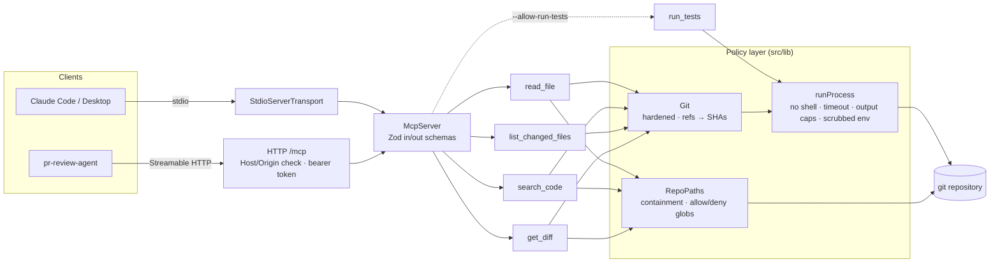

# mcp-repo-tools

An [MCP](https://modelcontextprotocol.io) server that gives AI agents safe, structured access to a
local git repository. It is built for code review: read files at any commit, search, diff a branch
the way a pull request does, and (only if you opt in) run allowlisted test commands.

It's the foundation of a three-part series on production AI engineering in the code-review domain:

| Repo                      | What it does                                                                                                       |
| ------------------------- | ------------------------------------------------------------------------------------------------------------------ |
| **mcp-repo-tools** (this) | MCP server: the agent's only window onto the repo                                                                  |
| `pr-review-agent`         | LangGraph.js agent that uses these tools to review a PR, with checkpointing and human approval                     |
| `gameable-tests-bench`    | Tasks with deliberately weak tests, plus a grader that catches agents gaming them (hardcoding, over-mocking, etc.) |

```text
read_file · search_code · list_changed_files · get_diff · run_tests (opt-in)
```

## Tools

Every tool validates its input with Zod and returns `structuredContent` that matches a published
output schema, plus a compact text rendering for chat clients. Refs are resolved to full SHAs and
echoed back, so a caller always knows exactly which commit it saw.

| Tool                 | Purpose                                                                                       | Key inputs                                                                 |
| -------------------- | --------------------------------------------------------------------------------------------- | -------------------------------------------------------------------------- |
| `read_file`          | Read a text file (or a line range) from the working tree or at any commit                     | `path`, `ref?`, `startLine?`, `endLine?`                                   |
| `search_code`        | `git grep` over tracked files: literal by default, optional regex, globs, context lines       | `query`, `regex?`, `caseSensitive?`, `pathGlobs?`, `ref?`, `contextLines?` |
| `list_changed_files` | Cheap index of a change: status, renames, `+/-` counts, `isBinary`, `isTest`                  | `base`, `head?`, `mode?`, `paths?`                                         |
| `get_diff`           | Unified diff split per file, filled up to a byte budget; each omitted patch says why          | `base`, `head?`, `mode?`, `paths?`, `contextLines?`, `maxBytes?`           |
| `run_tests`          | Run a **pre-configured** test target; returns exit code, timing and the tail of stdout/stderr | `target`, `args?`                                                          |

`mode` defaults to `merge-base` (what a PR shows, i.e. `base...head`); `direct` compares the two
commits as-is (`base..head`).

Errors come back as MCP tool errors (`isError: true`) with text `CODE: message`, where `CODE` is
one of `INVALID_INPUT`, `PATH_DENIED`, `NOT_FOUND`, `TOO_LARGE`, `INVALID_REF`, `TOOL_DISABLED`,
`TIMEOUT`, `GIT_ERROR` or `INTERNAL`. Inputs that fail the JSON schema itself are rejected by the
SDK before reaching a tool, with an `Input validation error` message.

## Architecture



Tools are plain definitions (`inputSchema`, `outputSchema`, `run`, `render`) in `src/tools/`, so
they're unit-tested without a server. All enforcement lives in `src/lib/`: **every** filesystem
read goes through `RepoPaths`, **every** subprocess through `runProcess`.

## Quick start

Requires Node ≥ 22.12, git ≥ 2.44 and pnpm. Linux or macOS.

```sh
git clone https://github.com/pshashanka/mcp-repo-tools && cd mcp-repo-tools
pnpm install && pnpm build
node dist/index.js --repo /path/to/your/repo   # speaks MCP on stdio
```

### Claude Code

```sh
claude mcp add repo-tools -- node /abs/path/to/mcp-repo-tools/dist/index.js --repo /abs/path/to/repo
```

Or add a project-scoped `.mcp.json` to the repo you want reviewed (use absolute paths):

```json
{
  "mcpServers": {
    "repo-tools": {
      "command": "node",
      "args": ["/abs/path/to/mcp-repo-tools/dist/index.js", "--repo", "/abs/path/to/repo"]
    }
  }
}
```

Then ask, for example: _"Review the changes on this branch against main. Start with
list_changed_files."_

### Claude Desktop

Add to `~/Library/Application Support/Claude/claude_desktop_config.json` (macOS) or
`%APPDATA%\Claude\claude_desktop_config.json`, then restart Claude Desktop:

```json
{
  "mcpServers": {
    "repo-tools": {
      "command": "node",
      "args": ["/abs/path/to/mcp-repo-tools/dist/index.js", "--repo", "/abs/path/to/repo"]
    }
  }
}
```

### Over HTTP (for agents and services)

```sh
MCP_REPO_TOOLS_TOKEN=$(openssl rand -hex 32) \
  node dist/index.js --repo /path/to/repo --transport http --port 3333
# → serving /path/to/repo at http://127.0.0.1:3333/mcp

claude mcp add --transport http repo-tools http://127.0.0.1:3333/mcp \
  --header "Authorization: Bearer $MCP_REPO_TOOLS_TOKEN"
```

### Enabling `run_tests`

`run_tests` needs both the `--allow-run-tests` flag and targets in a config file you control:

```sh
node dist/index.js --repo /path/to/repo --config ./mcp-repo-tools.example.json --allow-run-tests
```

See [`mcp-repo-tools.example.json`](mcp-repo-tools.example.json) for the config format. Every key
is optional.

### CLI reference

```text
--repo <path>        Repository to serve: the work tree root (default: current directory)
--config <file>      JSON config file (path policy, limits, test targets)
--allow-run-tests    Register the run_tests tool (needs targets in --config)
--transport <kind>   stdio (default) or http
--host <host>        HTTP bind address (default: 127.0.0.1)
--port <port>        HTTP port (default: 3333)
MCP_REPO_TOOLS_TOKEN If set, HTTP requests must send "Authorization: Bearer <token>"
```

## Security model

The threat model has two untrusted parties: **the repository** (it may be a stranger's pull
request) and **the model** (it reads that repository, so it can be prompt-injected by it). The
server enforces its policy whatever the model asks for. Full details are in
[SECURITY.md](SECURITY.md); in summary:

- **Read-only by default.** Four of the five tools only read. `run_tests` isn't even registered
  unless the operator passes `--allow-run-tests` and configures targets.
- **Path containment.** Paths must be repo-relative; `..`, absolute paths and NUL bytes are
  rejected. Symlinks are followed and the _real_ target is checked again, so a link can't reach
  outside the repo or reach a denied file.
- **Deny list.** `.git/`, `.env*`, private keys, `.npmrc`/`.netrc` and the like are never readable or
  searchable, in the working tree or at any commit. Matching is case-insensitive. Config can add to
  the deny list but can't remove the defaults. An optional allow list narrows things further.
- **Hardened git.** No shell, ever: arguments are passed as an array. Refs that look like options
  are rejected and refs are resolved to SHAs once. Pathspecs are literal unless a glob is
  explicitly wanted. System/global git config is ignored; fsmonitor, hooks, external diff and
  textconv are disabled (a hostile `.git/config` can name programs for git to run). No optional
  locks, no lazy network fetches.
- **Bounded everything.** Per-tool byte limits that a request can lower but never raise; git calls
  are killed once their output passes the cap; timeouts on every subprocess.
- **`run_tests` runs configured commands, not requested ones.** The client chooses a target name
  from an enum; extra args must fully match an operator-supplied regex. The process gets a scrubbed
  environment (no tokens or cloud credentials), its own process group (a timeout kills
  grandchildren too) and a hard timeout. It is **not** a container: it runs the repository's code
  with your user's permissions. For untrusted code, run the server inside a container or VM.
- **HTTP.** Binds to loopback; refuses other addresses without a token; constant-time token
  comparison; Host/Origin validation against DNS rebinding.
- **Config never comes from the served repo**, so a PR can't widen its own permissions.

## Design decisions

**git is the source of truth.** `search_code` is `git grep` and `read_file --ref` is
`git cat-file`. That means no ripgrep dependency, `.gitignore` is respected without extra work,
and every tool works at any commit, which matters when an agent needs the _old_ version of a file
to judge a change.

**Refs in, SHAs out.** A ref is validated and resolved once, and only SHAs reach later git
commands. Outputs echo the resolved SHAs (`base`, `head`, `mergeBase`, `ref`), so
`pr-review-agent` can checkpoint and resume against exactly the commits it reviewed even if the
branch moves.

**Pull-request semantics by default.** `get_diff` and `list_changed_files` diff from the merge
base, because a reviewer wants "what this branch changed", not "how it differs from main today".

**A cheap index, then content.** `list_changed_files` (with `isTest` and line counts) lets an agent
plan before it spends tokens on patches. It's also how a test-coverage check asks "did tests change
alongside the source?" without parsing diffs.

**Budgets degrade per file, not mid-hunk.** `get_diff` runs git once per file (bounded
concurrency), which maps patches to files exactly even for odd filenames. It fills a byte budget
with whole patches. Files that don't fit, are binary, or are denied stay in the list with
`patchOmitted` set to the reason, so the agent can ask for them specifically. A half-truncated hunk
is worse than none.

**Names are metadata; contents are policy.** A changed `.env` still appears in
`list_changed_files`, because "this PR touches secrets" is exactly what a reviewer should flag. Its
contents are never returned.

**Structured output and readable text.** Agents consume `structuredContent`; chat clients see a
grep-style or unified-diff rendering rather than escaped JSON. Error codes go in the text
(`CODE: message`) and not in `structuredContent`, because MCP clients validate `structuredContent`
against the success schema even on errors.

**A failing test run is a result, not an error.** `run_tests` returns `passed: false` with the
output. Only "couldn't run" is an error. Output keeps the _tail_, where failure summaries are.
`gameable-tests-bench` relies on this stable shape to score runs.

**One repo per server, stateless HTTP.** There's no `repo` parameter, which keeps the containment
model trivial; run one server per repo. HTTP creates a fresh server per request (the SDK's
stateless pattern), so there is no session state to leak between callers.

**Tools are data.** `defineTool({ inputSchema, outputSchema, run, render })` keeps the MCP wiring in
one small file (`src/server.ts`), and every tool is tested by calling `run` directly against a real
fixture repo. The fixture is built by a script at test time, so this repo contains no nested `.git`.

### Known limitations

- POSIX only (process groups, `/dev/null` for git config).
- `run_tests` runs in the current working tree. Running at an arbitrary ref (in a temporary
  `git worktree`) is a planned opt-in.
- `search_code` covers tracked files only, and its regexes are POSIX ERE, not PCRE.
- TypeScript is pinned to 6.0 until `typescript-eslint` supports the 7.x native compiler.

## Development

```sh
pnpm install
pnpm test        # Vitest: unit tests per tool and lib + MCP client integration tests
pnpm lint        # typescript-eslint, strict type-checked
pnpm typecheck
pnpm build
```

```text
src/
  index.ts            CLI: flags → config → transport
  server.ts           createServer(config): registers tools on an McpServer
  config.ts           Zod config schema and defaults
  tools/              one file per tool, plus the defineTool type
  lib/                paths, git, exec, changes, truncate, errors: all the enforcement
  transports/         stdio, http
test/
  fixtures/           builds a PR-shaped git repo in a temp dir
  unit/               per tool and per lib module
  integration/        SDK Client ↔ server over in-memory, stdio and HTTP
```

CI (GitHub Actions) runs lint, format check, typecheck, tests and build on Node 22 and 24.

## License

MIT
